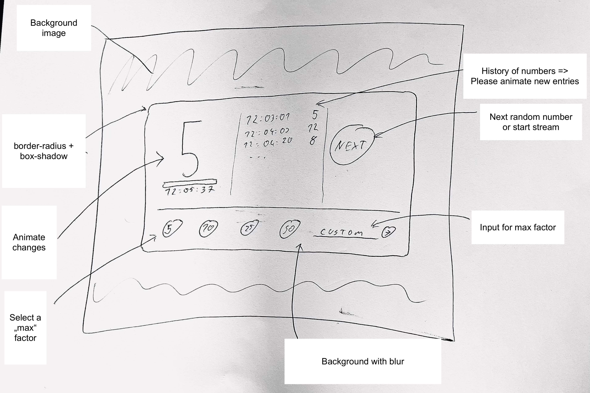

## Goal

- Create a (beautiful! :D ) UI that shows random numbers from querying https://dev.tapsell.de:13000/random
- There should be a transition between the change of values
- The return value is an int between 0 and `randomFactor`
- Log the history of obtained random numbers in a table with timestamps
- Change the random factor to another value by using method `PUT` https://dev.tapsell.de:13000/random/:factor where factor is the number
- Example: `curl -X PUT 'https://dev.tapsell.de:13000/random/50`

## Advanced
- Animated all state changes
- Responsive design
- Attach a readable stream via fetch API by setting the request header `X-Stream` to a value > 1
- Example: `curl --no-buffer -s -H "X-Stream: 120" https://dev.tapsell.de:13000/random`
- Help: https://web.dev/fetch-upload-streaming/

## Scribble

